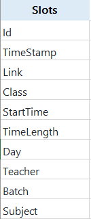
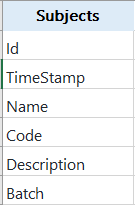
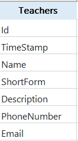
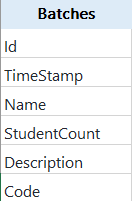

# College-TimeTable-Managment
A Basic TimeTable Managment System

<h3>
  Tables
  </h3>
  
  
  
  
  
 

<h5>To Start This Project</h5>
 
1) Open With VS In Github Page 
2) Write This Command In Package Manager Console => Add-Migration "Init" 
3) Then Write This Command In Paackage Manager Console  => Update-Database
